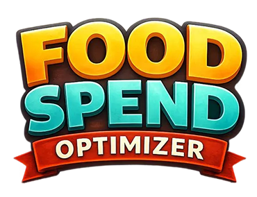

# 🍽️ Food Spend Optimizer

A personal finance application for tracking food expenses, managing cooking staff payments, and optimizing food costs. Built with Next.js and MongoDB.

## 📋 Project Overview

**Type:** Personal Finance · Expense Tracking · Cost Optimization  
**Development:** Vibecoded (AI-assisted)

### Problem Statement

Previously spending Rs 360–400 per day on daily food purchases, this system helps track the transition to batch cooking with hired staff. The app provides clear visibility into actual spending, savings, and staff payments.

### Key Benefits

- Track all food-related activities in one unified system
- Automatically calculate effective daily food cost
- Monitor savings compared to previous daily-buying baseline
- Maintain accurate ledger for cook payments (fees + reimbursements - payments)
- View financial metrics at a glance

## ✨ Features

### 🎯 Core Features

- **Unified Logging Form**: Single form for all record types (Cook, Grocery, Payment)
- **Smart Dashboard**: Real-time financial metrics and savings calculations
- **Monthly Breakdown**: Visualize spending patterns across months
- **Cook Payment Tracking**: Automatic calculation of amount due to staff
- **Edit & Delete**: Full CRUD operations with double-confirmation for deletes
- **Dual Date Display**: Shows both Gregorian and Nepali (Bikram Sambat) dates

### 📊 Dashboard Metrics

- **Amount Due to Cook**: Current outstanding balance
- **Avg Cost Per Day**: Effective food cost per calendar day
- **Monthly Savings**: Savings compared to baseline (Rs 360-400/day)
- **Monthly Spend Breakdown**: Spending visualization by month
- **Total Food Spend**: This month and all-time totals
- **Savings Breakdown**: Daily, weekly, monthly projections

### 📝 Record Types

1. **Cook Log**
   - Menu items cooked
   - Base fee per session
   - Auto-calculated: Days food lasted, per-day cost

2. **Grocery Log**
   - Category (Meat, Veggies, etc.)
   - Amount spent
   - Bought by (Staff or Me)
   - Auto-marked as reimbursable if bought by staff

3. **Payment Log**
   - Amount paid to staff
   - Payment method
   - Remarks (e.g., "Settlement", "Tip")
   - Tips are excluded from amount due calculations

## 🚀 Getting Started

### Prerequisites

- Node.js 18+ 
- MongoDB database
- npm or yarn

### Installation

1. **Clone the repository**
   ```bash
   git clone <repository-url>
   cd food-spend-optimizer
   ```

2. **Install dependencies**
   ```bash
   npm install
   ```

3. **Configure environment variables**
   
   Create a `.env.local` file in the root directory:
   ```env
   MONGODB_URI=mongodb://localhost:27017/food_spend_optimizer
   # Or use MongoDB Atlas connection string
   
   # Optional: Override default settings
   BASE_FEE=625
   BASELINE_DAILY_LOW=360
   BASELINE_DAILY_HIGH=400
   BASELINE_DAILY_AVG=380
   TRACKING_START_DATE=2025-11-01
   ```

4. **Run the development server**
   ```bash
   npm run dev
   ```

5. **Open the application**
   
   Navigate to [http://localhost:3000](http://localhost:3000)

## 📁 Project Structure

```
food-spend-optimizer/
├── app/
│   ├── api/
│   │   ├── logs/
│   │   │   ├── [id]/route.ts    # Edit/Delete single log
│   │   │   └── route.ts         # Create/List logs
│   │   ├── dashboard/route.ts   # Dashboard metrics
│   │   └── settings/route.ts    # App settings
│   ├── page.tsx                 # Main page
│   └── layout.tsx
├── components/
│   ├── Dashboard.tsx            # Metrics display
│   ├── LogForm.tsx              # Unified logging form
│   ├── LogList.tsx              # Recent logs with edit/delete
│   └── SettingsPanel.tsx        # Settings editor
├── lib/
│   ├── mongodb.ts               # MongoDB connection
│   ├── db.ts                    # Database utilities
│   ├── config.ts                # Settings management
│   └── calculations.ts          # Financial logic
├── types/
│   └── index.ts                 # TypeScript definitions
└── scripts/
    └── insert-real-data.ts      # Data seeding script
```

## 🔧 Configuration

### Editable Settings

Settings can be configured via:
1. Environment variables (`.env.local`)
2. Settings Panel in the UI
3. MongoDB `settings` collection

| Setting | Description | Default |
|---------|-------------|---------|
| `baseFee` | Base cooking fee per session | 625 |
| `baselineDailyLow` | Previous daily cost (low) | 360 |
| `baselineDailyHigh` | Previous daily cost (high) | 400 |
| `baselineDailyAvg` | Previous daily cost (average) | 380 |
| `trackingStartDate` | Optional tracking start date | First log date |

## 📊 Data Seeding

### Insert Sample Data

```bash
npm run seed:sample
```

### Insert Real Data

```bash
npm run seed:real
```

Scripts are located in `scripts/` directory.

## 🧮 Financial Calculations

### Amount Due to Cook
```
Amount Due = (BaseFee × CookCount) + StaffGroceries - Payments (excluding tips)
```

### Effective Cost Per Day
```
Avg Cost Per Day = Average of (CookCost / DaysUntilNextCook)
```
- Gap between cooks is capped at 4 days max
- Groceries are spread across all days in tracking window

### Savings Calculation
```
Daily Savings = BaselineAvg - EffectiveDailyCost
Monthly Savings = DailySavings × 30
```

## 🛠️ API Reference

### Logs

- `POST /api/logs` - Create new log entry
- `GET /api/logs?type=COOK&from=2025-01-01&to=2025-01-31` - List logs with filters
- `GET /api/logs/[id]` - Get single log
- `PUT /api/logs/[id]` - Update log
- `DELETE /api/logs/[id]` - Delete log

### Dashboard

- `GET /api/dashboard` - Get all metrics and aggregated data

### Settings

- `GET /api/settings` - Get current settings
- `PUT /api/settings` - Update settings

## 🎨 Features in Detail

### Smart Gap Calculation

- Automatically calculates days between cook sessions
- Caps gaps at 4 days to handle holidays/late cooking
- Shows per-day cost for each cook session

### Tip Handling

- Tips are automatically excluded from amount due calculations
- Detected via "tip" keyword in remarks/notes or explicit `isTip` flag

### Historical Balance Tracking

- Each cook log shows "Amount to be Paid (till this date)"
- Provides historical view of outstanding balances
- Helps verify settlement payments

## 🔒 Validation Rules

- All amounts must be positive numbers
- Dates cannot be in the future
- Base fee is snapshot at log creation (immutable)
- Reimbursable status auto-derived from "bought by" field
- Delete requires double confirmation (3 clicks)

## 🚧 Non-Goals

This system intentionally does NOT include:

- Multi-staff support
- Bank or wallet integrations
- Nutrition or calorie tracking
- Shared household accounts

## 🔮 Future Enhancements

- Cooking frequency optimization suggestions
- Cost spike detection (e.g., meat-heavy days)
- Weekly/monthly trend charts
- Export functionality (CSV, PDF)
- Mobile app or PWA version

## 🛡️ Technology Stack

- **Frontend**: Next.js 15, React, TypeScript, Tailwind CSS
- **Backend**: Next.js API Routes (serverless)
- **Database**: MongoDB
- **Date Conversion**: nepali-date-converter
- **Deployment**: Vercel (recommended)

## 📈 Success Criteria

The project is successful when:

- ✅ Any log entry can be added in under 15 seconds
- ✅ Dashboard answers at a glance:
  - How much do I owe the cook?
  - What is my effective cost per day?
  - How much am I saving monthly?
- ✅ Settings changes update calculations automatically
- ✅ All data persists reliably in MongoDB

## 📝 License

Personal project by Prajeet Shrestha

## 🤝 Contributing

This is a personal project, but suggestions and feedback are welcome!

## 🎨 Development Notes

This project was **vibecoded** - developed through natural language conversations with AI assistance. The entire application, from architecture to implementation, was built through iterative dialogue, demonstrating modern AI-assisted development workflows.

---

**Built with ❤️ to turn everyday decisions into measurable behavior change.**  
*Vibecoded with AI assistance • Next.js • MongoDB • TypeScript*
